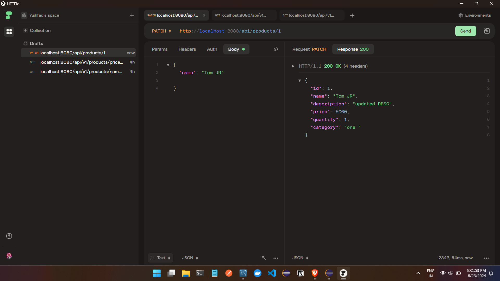
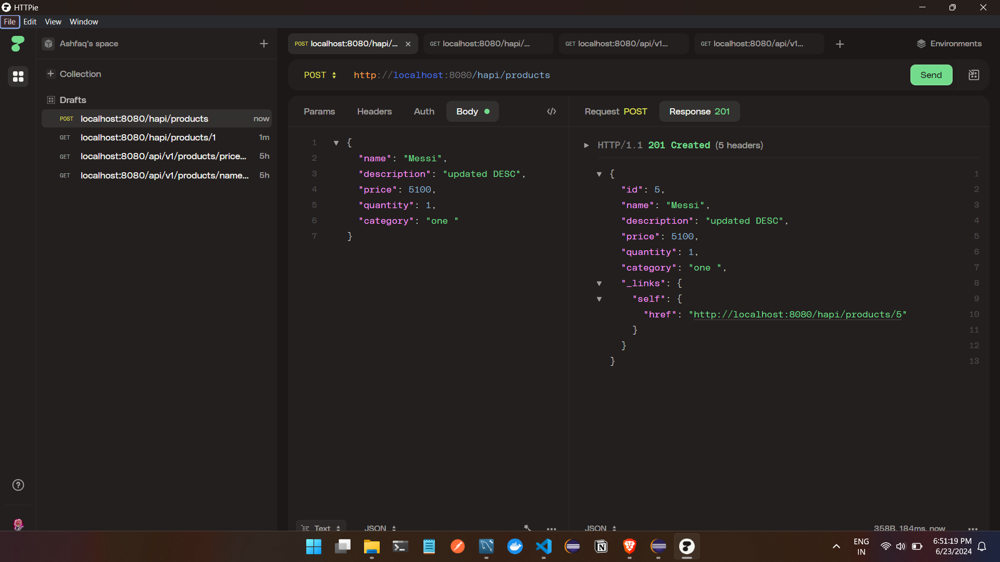
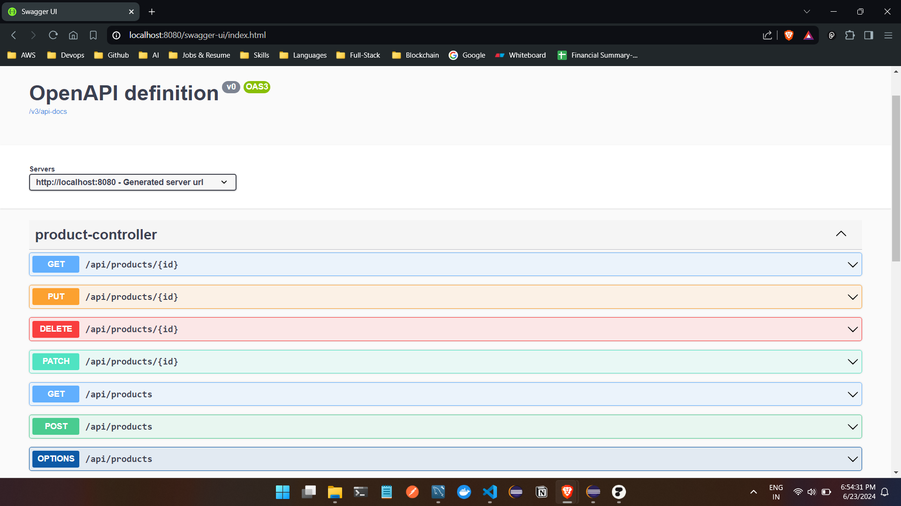
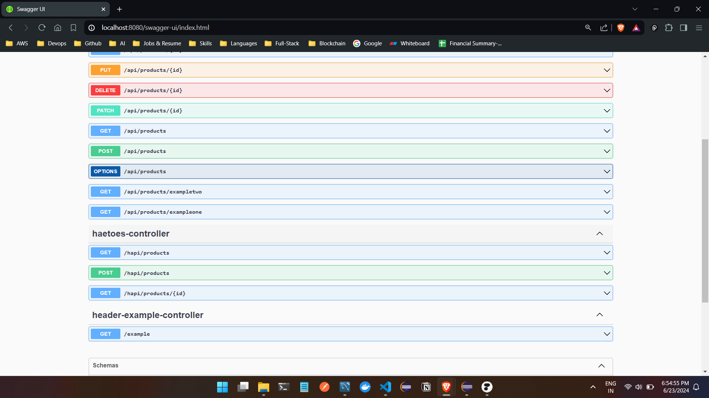
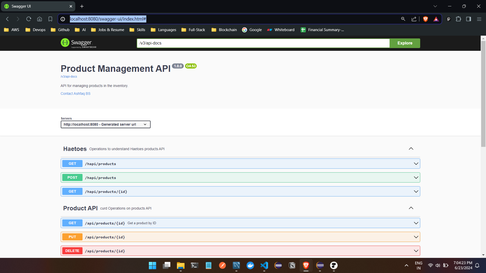

PUT

Patch 

Options 

This informs you that the GET, POST, PUT, DELETE, PATCH, and OPTIONS methods are supported by the /api/products endpoint. This can be particularly useful for clients to understand what actions they can perform on the endpoint without making actual requests.

Headers 

hateoas samples 

Swagger integration
URL : http://localhost:8080/swagger-ui/index.html#

extra configs 

